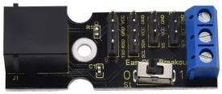
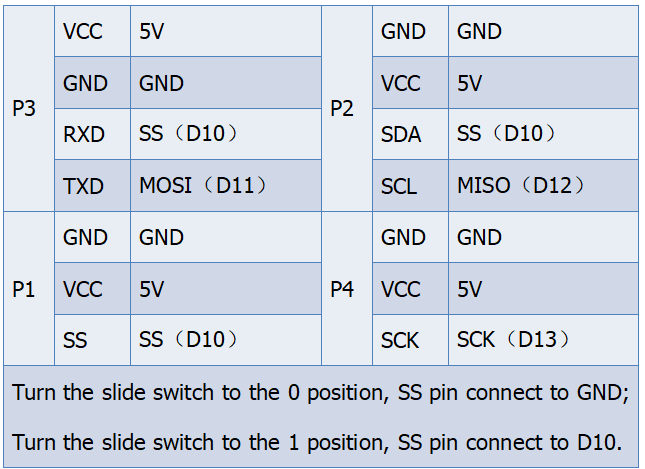
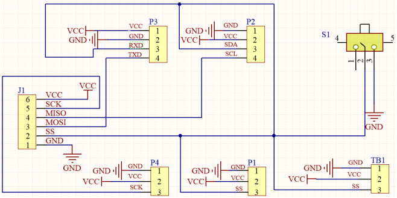

# KS0442 EASY Plug Breakout Board

## 1. Description

If the sensors/modules you use are not equipped with the EASY plug interface (RJ11 6P6C), it will cause you trouble to connect to keyestudio EASY plug Control Board V2.0.

We now specially design this EASY Plug Breakout board. It communicates with EASY plug Control Board V2 via SPI pin. It breaks out the power pins, digital pins of 2.54mm pitch and terminal block interface.

By programming, can realize the serial port communication, IIC communication and single IO pin signal control. The breakout board comes with a slide switch.

When turn the slide switch to 0 position, SS pin connects to GND, microcontroller **CAN’T** control the SS pin level! So CAN’T control the serial port communication and IIC communication!

When turn the slide switch to 1 position, SS pin suspends, microcontroller is able to control the SS pin level! So can realize the normal signal extension!

The EASY Plug Breakout board comes with a 3.2mm fixing hole.

## 2. Technical Details

- Interface: 2.54mm pin headers ; EASY plug (RJ11 6P6C )
- Fixing hole diameter：3.2mm
- Dimensions：49mm * 18mm * 16mm
- Weight：8.9g
- Environment attribute： ROHS

## 3. Interface Table

## 4. Schematics

